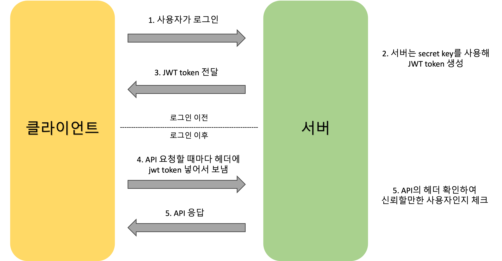
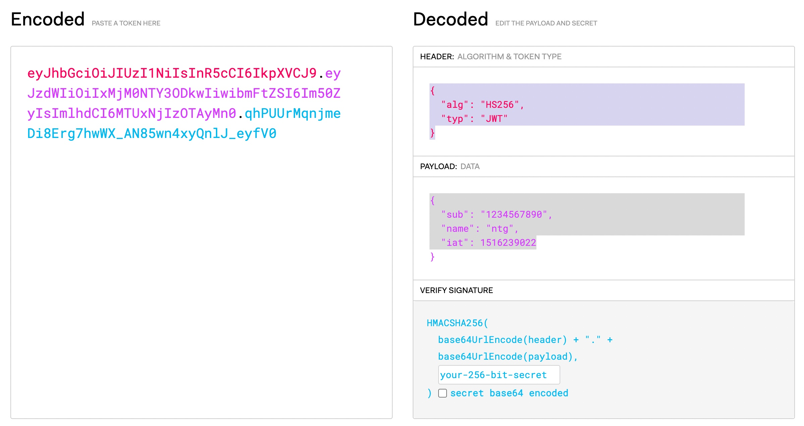

# ✅ SSO(Single Sign-On) 및 JWT 정리

## 1. SSO 로그인 이란?
**SSO (Single Sign-On)**는 Single Sign-On 의 약자로 여러 애플리케이션 로그인 화면을 하나로 결합하는 기술입니다. 
SSO 로그인 방식을 사용하게 되면 사용자는 1회 사용자 인증으로 다수의 SaaS 애플리케이션에 접근할 수 있다는 편리함이 있습니다.

- 한 번의 로그인 → 다수의 서비스 접근

---

## 2. SSO 로그인 방식의 장점
**SSO 로그인 방식의 장점**은 사용자들이 브라우저에서 직접 애플리케이션에 자주 액세스하기 때문에 서비스를 제공하는 기업에서는 보안에 대한 문제와 반복되는 사용자의 로그인 시도에 대한 개선이 필요한데, SSO 는 사용자의 검증이 한 번 완료가 되면 반복되는 로그인 없도록 한다는 점에서 보안과 사용자의 편리함 문제를 동시에 해결할 수 있다는 장점이 있습니다.

- ✅ **사용자 편의성**: 반복 로그인 없이 다양한 서비스 이용 가능
- ✅ **보안 강화**: 하나의 강력한 암호 사용 가능 → 보안 수준 향상
- ✅ **비용 절감**: 암호 재설정 요청 감소 → 운영 리소스 절약

---

## 3. 보안이 강화되는 이유
**SSO 로그인 방식이 보안에 좋은 이유**는 SSO를 사용하지 않을 때는 사용자가 여러 웹 사이트에 대한 암호를 기억해야 합니다. 이로 인해서 서로 다른 서비스의 계정들에 대한 암호를 기억하기 쉽게 하기 위해 단순하거나 반복적인 암호를 만드는 경우가 많다. 하지만 SSO 를 사용하게 되면 단일 서비스에서 강력한 비밀번호를 만들어도 서비스 이용에 불편함이 없기 때문에 암호 보안이 강화됩니다. 또한 기업은 사용자의 암호에 대한 정보, 재설정 요청처리 등 작업 부하가 과중될 수도 있는 상황에 노출되는 경우가 빈번합니다. SSO를 구현하면 암호를 잊어버리는 일이나 재설정 요청이 줄기 때문에 지원 리소스를 최소화 할 수 있습니다.

- 🔐 약한 암호 사용 줄어듦 → 보안성 향상
- 🔄 암호화된 토큰으로 인증 → 안전한 인증
- 📉 인증 관련 지원 작업 감소 → 운영 효율성 증가

---

## 4. SSO의 단점
**SSO 로그인 방식의 단점**은 ID 및 PW가 노출 시에 전체 시스템이 위험해지며, 이는 SSO 서버 침해의 경우도 마찬가지로 모든 서버의 보안 침해가 가능해진다.  또한 중앙 인증 서버를 통해 SSO를 제공하는 경우에는 중앙인증서버에 장애가 발생했을 때 연관 시스템 모두에 서비스 진입을 할 수 없는 문제가 있을 수 있습니다. 또한 높은 보안 요구사항과 초기 구축 비용이 필요하다는 단점이 있습니다.

- ⚠️ **단일 실패 지점(SPoF)**: 인증 서버 장애 시 전체 접근 불가
- 🔐 **높은 보안 요구**: 강력한 보안 정책 필요
- 💰 **초기 구축 복잡 및 비용**: 시스템 간 연동 시 호환성 고려 필요

---

## 5. 단점 해결 방안
**SSO 단점 해결 방안**으로는 다중 인증, 세션 관리, 암호화 등의 해결방안이 있습니다.

- 🔒 **다중 인증 (MFA)**: OTP, 생체 인식 등 추가 인증 절차 도입
- ⏱️ **세션 관리**: 자동 로그아웃, 유휴 세션 종료로 보안 유지
- 🔒 **암호화**: JWT 등 인증정보 암호화 전송 및 저장

---

## 6. SSO 구성 요소

| 구성 요소 | 설명 |
|-----------|------|
| 사용자 (User) | 로그인 요청 주체 |
| 클라이언트 애플리케이션 | 인증이 필요한 서비스 |
| SSO 인증 서버 | 사용자 인증을 담당하는 서버 |
| 토큰 (JWT, SAML, OAuth) | 인증 정보를 담은 수단 |

> 🔸 현재 시스템에서는 **JWT 기반 토큰 인증 방식** 사용 중
**JWT 기반 토큰 인증 방식**이란, WT(JSON Web Token) 와 같은 토큰을 사용하는 방식입니다. 사용자가 로그인하면 인증 서버가 암호화된 토큰을 발행하고, 이후 애플리케이션이 요청할 때마다 해당 토큰을 전송하여 인증 상태를 확인합니다. 토큰 이란 간단히 말하면 로그인 이후 서버가 만들어서 사용자에게 넘겨주는 문자열 입니다. 이 문자열은 사용자 정보가 암호화 되어있고 이 토큰을 이용하여 인증된 사용자인지 서버가 판단합니다. 이때 사용되는 토큰이 JWT(Json Web Token) 이고 하나의 표준 인증 방식으로 이해할 수 있습니다. 



## 7. 세션 기반 인증 vs JWT (JWT의 발생배경)

**세션 기반 인증 방식**
- 사용자가 로그인을 하면 서버가 세션 ID 를 생성하여 저장합니다.
- 클라이언트는 쿠키에 세션 ID 를 저장합니다.
- 이후 요청 시, 세션 ID를 포함한 쿠키를 서버에 전송합니다.
- 서버는 해당 ID로 사용자 상태를 확인합니다.

**세션 기반 인증 방식의 한계점**
- 사용자수가 증가 -> 세션 저장 공간 증가 -> 서버 확장이 어렵다는 단점이 있습니다.
- 여러 서버 간 세션 공유 필요한데 복잡한 구조가 필요합니다.

| 항목 | 세션 기반 인증 | JWT 기반 인증 |
|------|----------------|----------------|
| 상태 저장 | 서버에 세션 저장 필요 | 서버는 상태 저장 불필요 |
| 확장성 | 서버 확장 어려움 | 분산 서버에서도 유연하게 사용 |
| 공유 | 서버 간 세션 공유 필요 | 비밀키/공개키 기반으로 어디서나 검증 가능 |

---

## 8. JWT 구조 및 예시
**JWT**는 세 파트로 나누어지며, 각 파트는 점으로 구분하여 xxxxx.yyyyy.zzzzz 이런식으로 표현됩니다.
순서대로 헤더(Header), 페이로드(Payload), 서명(Signature) 로 구성합니다.


### 🔸 헤더(Header)
- Header 는 두가지의 정보를 지니고 있습니다. typ : 토큰의 타입을 지정합니다. 바로 JWT 입니다.
                      alg : 해싱 알고리즘을 지정합니다. 해싱 알고리즘으로는 보통 HMAX SHA256(서명 암호화 하는 알고리즘) 가 사용됩니다.
```json
{
  "alg": "HS256",
  "typ": "JWT"
}
```

### 🔸 페이로드(Payload)
- 토큰의 내용물이 인코딩된 부분입니다. 즉, 토큰에 담을 정보가 들어있는 부분입니다. 여기에 담는 정보의 한 ‘조각’을 클레임이라고 부르고 이는 Json(Key/Value) 형태의 한 쌍으로 이뤄져 있습니다. 토큰에는 여러개의 클레임들을 넣을 수 있습니다.

```json
{
  "sub": "1234567890",
  "name": "ntg",
  "iat": 1516239022
}
```

### 🔸 시그니처(Signature)
- Header 에서 정의한 알고리즘 방식을 통해 헤더 + 페이로드와 서버가 갖고 있는 유일한 key 값을 합친 것을 헤더에서 정의한 알고리즘으로 암호화합니다.




### 참조
```
https://aws.amazon.com/ko/what-is/sso/
https://velog.io/@duck-ach/SSO-SSOSingle-Sign-On%EC%97%90-%EB%8C%80%ED%95%B4%EC%84%9C
https://play-with.tistory.com/362
https://hoime.tistory.com/94
https://velopert.com/2389
https://velog.io/@chuu1019/%EC%95%8C%EA%B3%A0-%EC%93%B0%EC%9E%90-JWTJson-Web-Token
https://blog.bizspring.co.kr/%ED%85%8C%ED%81%AC/jwt-json-web-token-%EA%B5%AC%EC%A1%B0-%EC%82%AC%EC%9A%A9/
https://velog.io/@duck-ach/SSO-SSOSingle-Sign-On%EC%97%90-%EB%8C%80%ED%95%B4%EC%84%9C
https://jwt.io/
```


